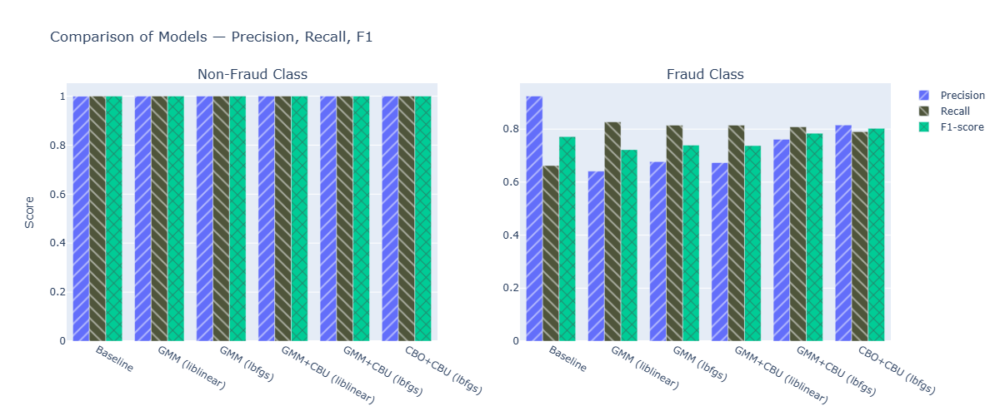

# DA5401: Assignment 4 — Addressing Class Imbalance with GMM-Based Sampling

## Student Details
- **Name:** Chirag  
- **Roll Number:** DA25M008  

---

## 📌 Assignment Overview
This project extends Assignment 3 by introducing **Gaussian Mixture Model (GMM)-based sampling** to tackle class imbalance in credit card fraud detection.  
The dataset contains an extreme imbalance between the majority class (**non-fraud**) and the minority class (**fraud**).  
The objective is to evaluate whether modelling the minority class distribution with **GMM** and combining it with **clustering-based undersampling (CBU)** can improve Logistic Regression’s ability to detect fraud.

The following approaches were compared:

* **Baseline (no resampling)**
* **GMM Oversampling** (two solvers: liblinear and lbfgs)
* **Hybrid GMM+CBU** (two solvers: liblinear and lbfgs)
* **Hybrid CBO+CBU** (lbfgs)

---

## ⚙️ Methodology

1. **Data Splitting**: Training, validation and test sets created using stratified splits to preserve class ratios.  
2. **Resampling Approaches**:
   * **GMM Oversampling**: Fit a Gaussian Mixture Model on fraud cases and generate synthetic samples to increase minority class size.
   * **Hybrid GMM+CBU**: Combine GMM-generated frauds with clustering-based undersampling of the majority class.
   * **Hybrid CBO+CBU**: Combine CBO-generated frauds with clustering-based undersampling of the majority class.
3. **Model**: Logistic Regression trained on each resampled dataset (both liblinear and lbfgs solvers).
4. **Evaluation Metrics**:
   * **Precision, Recall, F1-score** for both Fraud and Non-Fraud.
   * **PR-AUC (Precision-Recall AUC)**.
   * **ROC-AUC (Receiver Operating Characteristic AUC)**.
5. **Visualization**: Metrics compared across all methods using Plotly bar plots (patterns added for grayscale readability).

---

## 📊 Results Summary (Fraud Class)

| Method              | Precision | Recall | F1-score | PR-AUC | ROC-AUC |
| ------------------- | --------: | ------:| --------:| ------:| -------:|
| Baseline            | **0.9245** | 0.6622 | 0.7717 | 0.7103 | 0.9543 |
| GMM (liblinear)     | 0.6411 | **0.8272** | 0.7224 | 0.6925 | 0.9670 |
| GMM (lbfgs)         | 0.6769 | 0.8148 | 0.7395 | 0.7067 | 0.9769 |
| GMM+CBU (liblinear) | 0.6735 | 0.8148 | 0.7374 | 0.6997 | 0.9637 |
| GMM+CBU (lbfgs)     | 0.7616 | 0.8086 | 0.7844 | 0.7109 | 0.9733 |
| CBO+CBU (lbfgs)     | 0.8153 | 0.7901 | **0.8025** | 0.7075 | 0.9496 |

**Key Findings:**

* **Baseline**: Very high precision but moderate recall (misses many frauds).
* **Plain GMM Oversampling**: Boosts recall but sacrifices precision → more false alarms.
* **Hybrid Methods**: Restore much of the lost precision while maintaining high recall.
* **CBO+CBU (lbfgs)**: Achieves the **highest F1-score (0.80)**, offering the best trade-off between catching frauds and minimizing false alarms.

---

## ✅ Conclusion

* **GMM-based sampling**, especially when combined with **CBU**, significantly improves the model’s ability to detect the minority (fraud) class.
* **CBO+CBU** with lbfgs solver provides the best balance between recall and precision.
* These results confirm the theoretical expectation: GMM captures the multi-modal structure of fraud data better than local interpolation methods like SMOTE, and clustering-based undersampling prevents the model from being overwhelmed by majority class instances.

📌 In fraud detection, recall is critical — but too many false positives increase manual review cost. **Hybrid GMM-based approaches, particularly CBO+CBU, are the most practical choice in this analysis.**
